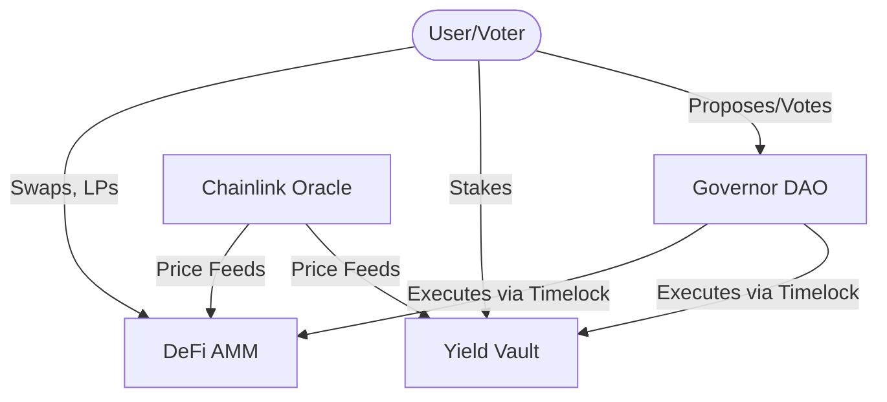
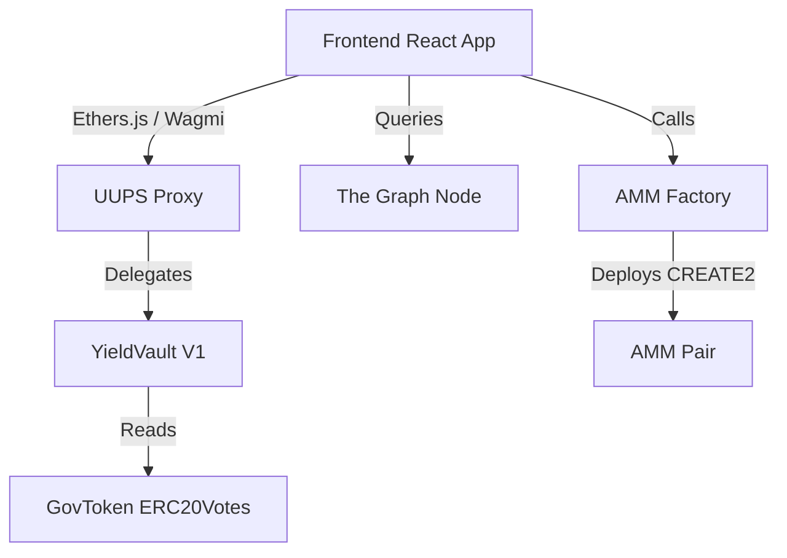
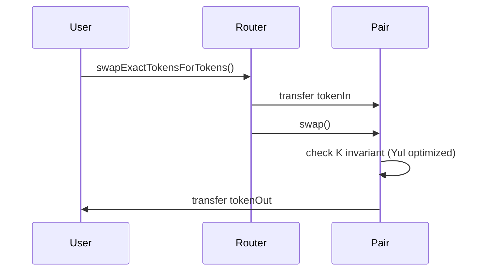
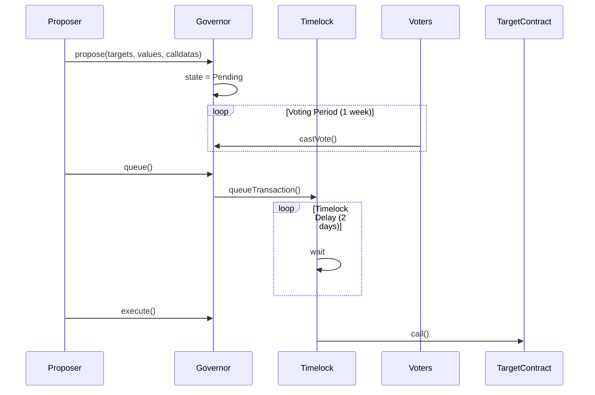

# Project Architecture & Technical Specification

## 1. System Overview (C4 Level 1)
The DeFi Super-App is a modular ecosystem on Arbitrum Sepolia consisting of a Constant Product AMM, a Yield-Optimized Vault, and a Governance DAO.

## 2. Component Breakdown (C4 Level 2)

## 3. Sequence Diagrams

### 3.1 Swap Execution

### 3.2 Governance Lifecycle

## 4. Data Model & Storage Layout

### YieldVault (UUPS) Storage
To prevent storage collisions during upgrades, `YieldVault` utilizes the standard ERC-4626 storage variables appended to OpenZeppelin's upgradeable storage gaps.
- `slot 0`: `_initialized` and `_initializing` (Initializable)
- `slot 1-50`: `__gap` for base contracts.
- `slot 51`: `asset` address.

**Rule**: New variables in V2 MUST be added after the existing variables.

## 5. Trust Assumptions
- **TimelockController**: Holds the ultimate authority. Compromise of the Timelock means complete protocol takeover. Delay is set to 2 days to allow users to exit if a malicious proposal passes.
- **Admin Roles**: Factory owner can pause new pair creation but cannot freeze existing pairs.
- **Oracle Risk**: Relies on Chainlink. If Chainlink nodes go offline, the staleness check will revert transactions, halting protocol functions that rely on price discovery, rather than allowing trades at bad prices.

## 6. Architectural Decision Records (ADR)

### ADR 1: UUPS vs Transparent Proxy
- **Context**: Need upgradeability for YieldVault.
- **Decision**: UUPS.
- **Consequences**: Cheaper deployments, upgrade logic is inside the implementation, reducing proxy overhead.

### ADR 2: Yul for AMM Math
- **Context**: AMM square root calculations for LP shares are gas-heavy.
- **Decision**: Inline Yul assembly for `sqrt`.
- **Consequences**: Harder to read, but saves ~2000 gas per mint/burn.

### ADR 3: Foundry vs Hardhat
- **Context**: Testing framework selection.
- **Decision**: Foundry.
- **Consequences**: Fuzzing and Invariant testing built-in, native Solidity tests, 10x faster execution.
